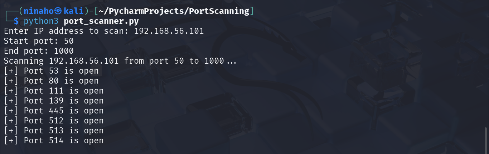

# Python Port Scanner

A simple command-line port scanner built with Python's `socket` library. This tool scans for open TCP ports on a target host to help identify potential exposure in a network.

## Features

- Scan for open ports on a specified host
- Adjustable scanning range (start port to end port)
- Simple and lightweight - no external libraries required
- CLI-based for ease of use

## Tools & Technologies Used

- Kali Linux 
- Metasploitable2 (Target VM) with IP address `192.168.56.101`
- Python 3.13.2 installed in Kali Linux
- `socket` (built-in Python networking library)

## How It Works

The script uses Python's `socket` library to:

1. Take an IP address from the user.
2. Define a range of ports to scan.
3. Attempt to connect to each port.
4. If a connection is successful, the port is considered open.

### The Script

```
import socket

target = input ("Enter IP address to scan: ")
start_port = int(input ("Start port: "))
end_port = int(input("End port: "))

print(f"Starting {target} from port {start_port} to {end_port}...")
for port in range(start_port, end port +1):
    s = socket.socket(socket.AF_INET, socket.SOCK_STREAM)
    s.settimeout(0.5)
    result = s.connect_ex((target, port))
    if result == 0:
        print(f" [+] Port {port} is open")
    s.close      
```
Saved the script as `port_scanner.py`

---

### Run the Script In Kali Terminal

After running the script, the user is prompted to enter the target host IP address and the range of ports to scan. 

For this project, Metasploitable2 VM with IP address 192.168.56.101 running in a virtualized, controlled environment as Kali Linux VM was the target host and therefore was scanned as shown in the sample below:


*Screenshot on running the python port scanning script in Kali terminal*

---

Example Use Cases

- Check which services are exposed on your local machine

- Scan a remote host for misconfigured open ports

- For learning about TCP/IP and network reconnaissance

---

Legal Disclaimer

This tool is for educational purposes only, and should not be used to scan networks without proper authorization. Unauthorized port scanning is illegal in many jurisdictions.

---

